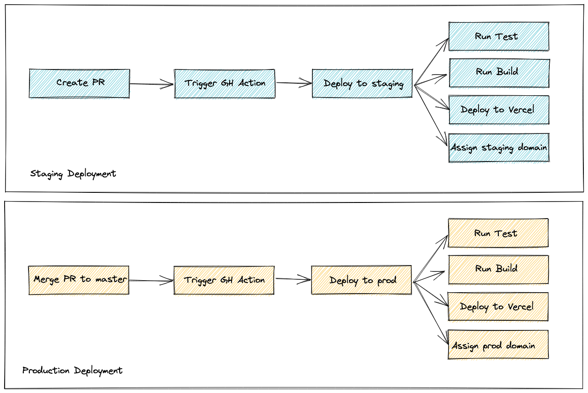

# 🎠 Playground

Built using Razzle, a simple fullstack solution for Express x React

## Live

- Production: [razzle-playground.vercel.app](https://razzle-playground.vercel.app/)
- Staging: `staging-{{PR_NUMBER}}-razzle-playground.vercel.app`

## Prerequisites

- Node.js LTS, [download here](https://nodejs.org/en/download/)
- Yarn, `npm i -g yarn`

## Local Development

### Using Docker

> If your `docker-compose` version is above `v1` please downgrade first using this command

```
docker-compose disable-v2
```

Run compose

```bash
docker-compose -f docker-compose.dev.yml up
```

- Open the browser on [http://localhost:3000/](http://localhost:3000/)

### Using Local Node.js

- Install dependencies

```
yarn
```

- Spin up the app

```
yarn start
```

- Open the browser on [http://localhost:3000/](http://localhost:3000/)


## CI/CD - Staging & Prod



---

mazipan :copyright: 2021